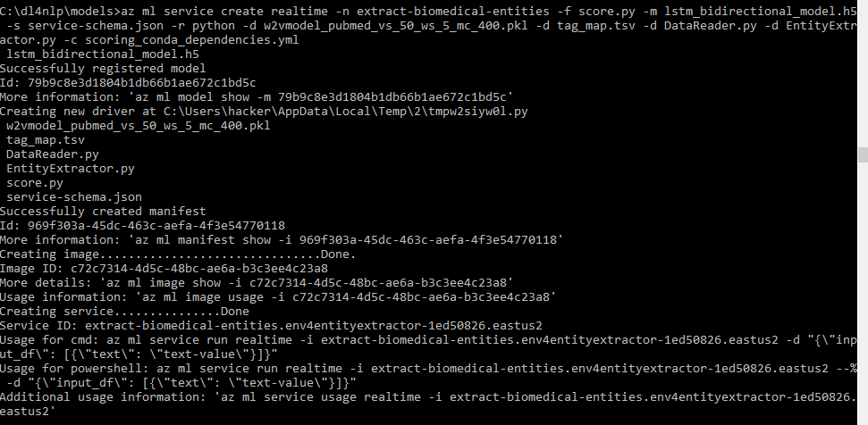

## 4. Deployment
### [Operationalization of the neural entity extraction model](score.py)

### Objective

The aim of the [companion script](score.py) is to show how to use Azure ML workbench to deploy and operationalize the deep learning model (saved in hd5 format)  trained in the [Model Creation Phase](02_modeling/02_model_creation/ReadMe.md). 

### Steps

#### Create Azure ML model management account

You will need an Azure ML model management account to deploy and manage your models as real-time web services. So please include it when creating the ML  experimentation account. As part of the ML experimentation account creation experience, you have an option to also create the ML model management account. I didn't created one, run the following command from the CLI window to create a new model management account. 

```
az ml account modelmanagement create -n myamlacct -l eastus2 -g myamlenvrg 
```

#### Local mode deployment
Local mode deployment runs in Docker containers on your local computer, whether that is your personal machine or a VM running on Azure. You can use local mode for development and testing. The Docker engine must be running locally to complete the operationalization phase.  

#### Cluster mode deployment

If you need to scale out your deployment or if you don't have Docker engine installed locally, you can choose to deploy the web service on a cluster. In cluster mode, your web service is hosted in the Azure Container Service (ACS). The operationalization environment provisions Docker and Kubernetes in the cluster to manage the web service deployment. Deploying to ACS allows you to scale your service as needed to meet your business needs. To provision an ACS cluster and deploy the web service into it, add the --cluster flag to the set up command. The number of agent VM nodes to provision in the ACS cluster can be specified using the argument --agent-count. For more information, enter the --help flag.

```
az ml env setup -n dl4nlpenv -l eastus2 --cluster --agent-count 5
```
The ACS cluster environment may take 10-20 minutes to be completely provisioned.
To see if your environment is ready to use, run the following command from the CLI window:

```
  az ml env show -g dl4nlpenvrg -n dl4nlpenv
```

Once your environment has successfully provisioned, you can set it as your target context using:
```
  az ml env set -g dl4nlpenvrg -n dl4nlpenv
```
Now you are ready to operationalize the Keras TensorFlow LSTM entity extraction model.
To deploy the web service, you must have a model, a scoring script, and optionally a schema for the web service input data. The scoring script loads the model.h5 file from the current folder and uses it to extract the entity mentions in a given text. 

Copy the following files into the same folder (let us say, c:\dl4nlp\models):
* scoring_conda_dependencies.yml
* model.h5
* [score.py](score.py)
* resources.pkl
* [DataReader.py](../02_modeling/02_model_creation/DataReader.py)
* [EntityExtractor.py](../02_modeling/02_model_creation/EntityExtractor.py)

where the model.h5 file and the resources.pkl file are the output of the model creation phase. The resources.pkl file contains the trained model metadata and the word embedding lookup table and the Python scripts DataReader.py and EntityExtractor.py comes with the project under code/02_modeling/02_model_creation.

We will use a schema file to help the web service parse the input data. To generate the schema file, simply execute the scoring Python script [score.py](score.py) that comes with the project under code/03_deployment in the command prompt. Make sure that you are using Azure ML Python environment.

```
C:\dl4nlp\models> C:\Users\<user>\AppData\Local\amlworkbench\Python\python.exe score.py
```

Running this file creates a service-schema.json file under the current working directory that contains the schema of the web service input. It also test the scoring script before creating the web service.

To create a realtime web service called extract-biomedical-entities, 
1. Run the Azure ML Workbench installed into your DS VM.
2. Open command line window (CLI) by clicking File menu in the top left corner of AML Workbench and choosing "Open Command Prompt."  
3. Change the current working directory to the folder where you copied the above files. 
4. Run the following command.

```
az ml service create realtime -n extract-biomedical-entities -f score.py -m model.h5 -s service-schema.json -r python -d resources.pkl -d DataReader.py -d EntityExtractor.py -c scoring_conda_dependencies.yml  
```

An example of a successful run of az ml service create looks as follows. 



In addition, you can also type the following command to list the created web services.

```
az ml service list realtime
```

To test the service, execute the returned service run command.

```
az ml service run realtime -i extract-biomedical-entities.env4entityextractor-1ed50826.eastus2 -d "{\"input_df\": [{\"text\": \" People with type 1 diabetes cannot make insulin because the beta cells in their pancreas are damaged or destroyed.\"}]}"

```


